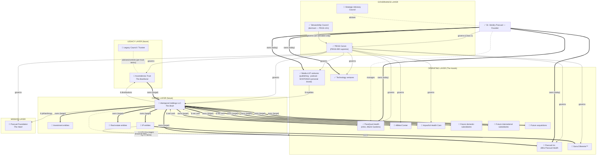

# PEGS-150.002 — Enterprise Ecosystem Blueprint

| Field | Value |
|---|---|
| Document ID | PEGS-150.002 |
| Series | 150 — Enterprise Architecture (02-Governance) |
| Version | 0.1.0 |
| Status | DRAFT — awaiting Founder ratification |
| Custodian | Founder (Chief Enterprise Architect function) |
| References | PEGS-150.001; PEGS-100 §1–§3; PEGS-101; L09 intercompany guide |
| Review cadence | On any entity change (PEGS-100 §2 rule) + annual |

> **Extends PEGS-100.** The ratified entity map (PEGS-100 §2) remains
> authoritative for what exists TODAY. This blueprint maps the full
> intended ecosystem including Founder-declared entities not yet on that
> map — each marked ✅ (ratified on PEGS-100), 🔶 (Founder-declared,
> relationship TO CONFIRM), or 🔮 (future). A PEGS-100 amendment is
> required before 🔶 entities are treated as canon (see Missing
> Information Report).

---

## 1. Master ecosystem diagram

**Edge legend (relationship types):**

| Arrow | Relationship |
|---|---|
| `==>` thick, label **owns** | Ownership (equity/beneficial) |
| `-->` solid, label **governs** | Governance (constitutional/board authority) |
| `-.->` dashed, label **manages** | Management (operational direction) |
| `-.-` dotted line, label **advises** | Advisory (counsel, no authority) |
| `-->` solid, label **$** | Cash flow (conceptual — PEGS-150.005) |
| `-->` solid, label **controls** | Control without ownership (e.g., trustee powers) |

## 2. Relationship register (every connection, labeled)

| From | To | Relationship | Status | Note |
|---|---|---|---|---|
| Founder | PEGS canon | governs (Class 1) | ✅ | Until succession (PEGS-101) |
| PEGS canon | every entity | governs | ✅ | Adoption on day one (PEGS-100 §4–§5) |
| Founder | PassQual Health | owns + manages | ✅ | Current state |
| Founder | Pascual Inc. d/b/a Pascual Health | owns | 🔶 | Relation to PassQual Health TO CONFIRM |
| Founder | AllMed Center | TO CONFIRM | 🔶 | Ownership %, role TO CONFIRM |
| Founder | Impactful Health Care | TO CONFIRM | 🔶 | Ownership %, role TO CONFIRM |
| <owner TBD> | Sana Diferente™ | owns (mark) | 🔶 | Trademark owner + entity class TO CONFIRM |
| Founder/family | Pascual Foundation | founds/governs | 🔶 | Formation status TO CONFIRM (05-Foundation README says not yet formed) |
| Ascendencia Trust | Atemporal Holdings | owns | 🔮 | Target state |
| Atemporal Holdings | all OpCos + INV/IP/RE | owns + coordinates | 🔮 | Via mgmt agreements (L09) |
| Trustee/Legacy Council | Ascendencia Trust | controls per instrument | 🔮 | Defined with counsel |
| Strategic Advisory Council | Founder | advises | 🔮 | Charter template ready (L03) |
| Stewardship Council | constitutional authority | governs on activation | ✅ | Dormant (PEGS-101 §1) |
| OpCos | Holdings | $ net cash up | 🔮 | Waterfall per L09 capital policy |
| Holdings | Foundation | $ philanthropy | 🔮 | Per giving policy |
| IP entity | OpCos | licenses marks/content | 🔮 | Per L09 IP licensing terms |

## Governance notes

- 🔶 rows are **declared, not ratified**: they enter canon only via a
  PEGS-100 amendment (Art. VIII §3) once relationships are confirmed.
- SOSTENGO remains bound by the Brand Firewall regardless of structure:
  the personal brand is licensed, never sold (L09 §3).

## Implementation recommendations

1. Founder completes the Missing Information Report answers; then amend
   PEGS-100 §2 in one PR (the ecosystem's ✅ set becomes complete).
2. Trust/Holdings edges remain "target state" until counsel forms them
   (Phase 6); no document should treat them as existing before then.

## Future dependencies

PEGS-150.004 (per-entity governance rows) · PEGS-150.005 (cash detail) ·
Phase 6 legal formation · PEGS-100 amendment.

## Revision history

| Version | Date | Change | Author |
|---|---|---|---|
| 0.1.0 | 2026-07-19 | Initial draft (Phase 3.5) | Chief Enterprise Architect, at Founder direction |
