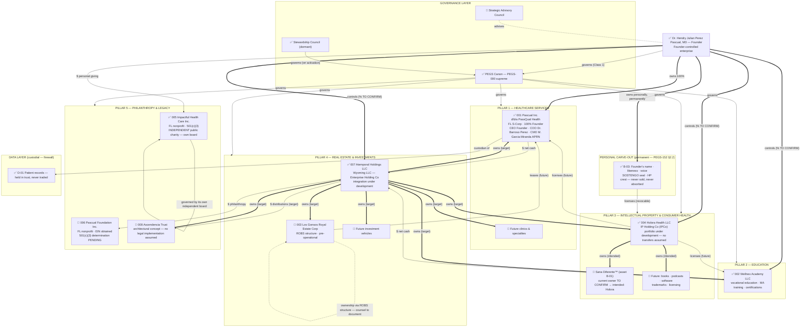

# PEGS-150.002 — Enterprise Ecosystem Blueprint

| Field | Value |
|---|---|
| Document ID | PEGS-150.002 |
| Series | 150 — Enterprise Architecture (02-Governance) |
| Version | 0.3.0 |
| Status | DRAFT — awaiting Founder ratification (Amendment A1 incorporated) |
| Custodian | Founder (Chief Enterprise Architect function) |
| References | PEGS-100 v1.1.0 (Amendment A1 — verified entities & pillars); PEGS-150.001; PEGS-151; PEGS-152; PEGS-153; PEGS-210.001–.008 (entity profiles); L09 |
| Review cadence | On any entity or asset-class change + annual |

> **Founder-verified (Amendment A1, 2026-07-19).** This blueprint now maps
> the VERIFIED enterprise structure supplied by the Founder — eight
> entities in five permanent pillars — plus the asset layers (PEGS-151)
> and target ownership (PEGS-152). Marks: ✅ verified · 🔸 verified but
> pre-operational or pending · 🔮 future/architectural. No legal
> implementation is assumed for 🔮 items; no IP transfers are assumed
> for Holora Health.

---

## 1. Master ecosystem diagram (five pillars + asset & governance layers)

**Edge legend:** `==>` **owns** · `-->` **governs** · `-.->` **manages**
· `-.-` **advises** · `-->|$|` cash flow · `-->|licenses|` IP use ·
`-->|leases|` RE use · `-->|controls|` control w/o ownership.

## 2. Relationship register (every connection, labeled)

| From | To | Relationship | Status | Note |
|---|---|---|---|---|
| Founder | PEGS canon | governs (Class 1) | ✅ | Until succession (PEGS-101) |
| PEGS canon | all pillars/entities | governs | ✅ | IHC: influence only — independent board governs (see below) |
| Founder | Pascual Inc. (PassQual Health) | owns 100% + serves as CEO | ✅ | Verified; officers: COO Dr. Arlenis Barroso Perez, CMO Martha Garcia Miranda APRN |
| Founder | Wellnex Academy LLC | controls (% TO CONFIRM) | ✅ | Education OpCo |
| Founder | Holora Health LLC | controls (% TO CONFIRM) | ✅ | IPCo — no IP transfers assumed yet |
| Founder | Atemporal Holdings LLC | controls (% TO CONFIRM) | ✅ | WY LLC; integration under development |
| ROBS structure | Los Gonsos Royal Estate Corp | owns per ROBS | 🔸 | Retirement-plan-funded formation; counsel documents specifics |
| Founder | Impactful Health Care Inc. | co-founder; strategic influence, NO control | ✅ | Independent board governs; not part of ownership structure |
| Founder (as founder) | Pascual Foundation Inc. | founds/governs pre-Council | 🔸 | Family foundation; tax-exempt status PENDING — never described as exempt until determination |
| Ascendencia Trust | Atemporal Holdings | owns (target) | 🔮 | Doctrine statement (PEGS-152 §2); no implementation assumed |
| Atemporal Holdings | OpCos + Holora + Los Gonsos + future vehicles | owns + coordinates (target) | 🔮 | Migration per PEGS-152 §5, counsel-designed |
| Holora Health | Sana Diferente™ + future IP | owns (intended) | 🔸 | Current mark owner TO CONFIRM; transfer not assumed |
| Founder personally | B-03 marks (name, likeness, SOSTENGO, crest) | owns permanently; licenses revocably | ✅ | Permanent carve-out — outside every entity incl. Trust |
| Los Gonsos | Pascual Inc. | leases premises (future model) | 🔮 | If/when it acquires operating real estate |
| Pascual Inc. | patient records (D-01) | custodian | ✅ | Firewall — custodial, never commercial |
| OpCos | Atemporal Holdings | $ net cash (target waterfall) | 🔮 | Behavioral waterfall now; papered flows post-integration |
| Atemporal Holdings | Pascual Foundation | $ philanthropy (target) | 🔮 | Per giving policy once exemption issues |

## Governance notes

- **Impactful Health Care Inc. is architecturally distinct:** an
  independent public charity with its own board. PEGS does not govern it;
  the Founder's role is co-founder influence. It appears in Pillar 5 for
  strategic context only — never in the ownership chain, never
  consolidated.
- **Pascual Foundation** is described as "tax-exempt status pending" in
  every artifact until the IRS determination issues.
- **Los Gonsos ROBS note:** the ROBS structure has specific ownership and
  compliance implications — architecture flags it; counsel documents it
  (no tax advice here).

## Implementation recommendations

1. Ratify with Amendment A1 (PR #6/#5); the 🔸 items carry follow-ups in
   the entity profiles (PEGS-210 series).
2. Phase 6 counsel briefing set now includes the ROBS structure and the
   Wellnex/Holora/Atemporal ownership-percentage confirmations.

## Future dependencies

IRS determination (Foundation) · Sana Diferente™ ownership confirmation
and any future assignment to Holora (counsel) · Atemporal integration
design · Ascendencia formation · Los Gonsos activation.

## Revision history

| Version | Date | Change | Author |
|---|---|---|---|
| 0.1.0 | 2026-07-19 | Initial draft (Phase 3.5) | Chief Enterprise Architect |
| 0.2.0 | 2026-07-19 | Regenerated as complete asset ecosystem (PEGS-151/152 layers) | Chief Enterprise Architect |
| 0.3.0 | 2026-07-19 | **Amendment A1:** Founder-verified 8-entity structure, five permanent pillars, verified officers, IHC independence, Foundation pending status, ROBS note, Holora as IPCo, Atemporal as existing WY LLC | Chief Enterprise Architect, from Founder-supplied data |
