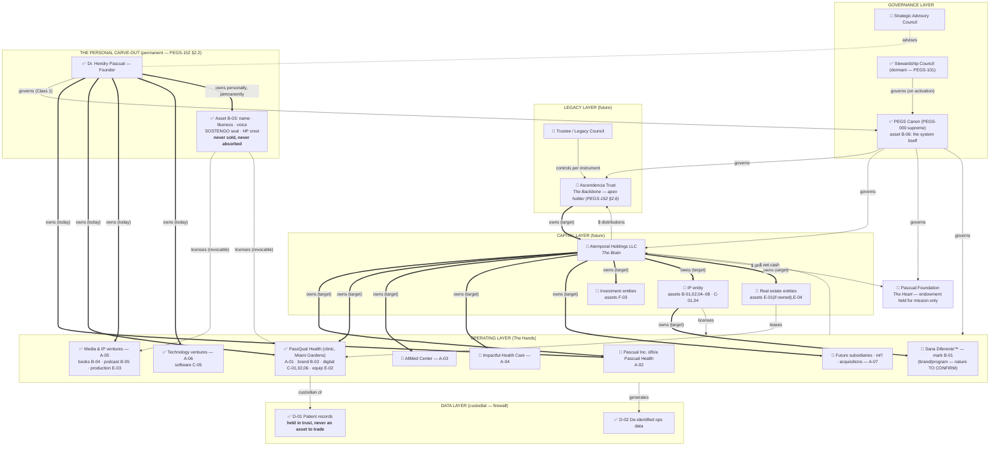

# PEGS-150.002 — Enterprise Ecosystem Blueprint

| Field | Value |
|---|---|
| Document ID | PEGS-150.002 |
| Series | 150 — Enterprise Architecture (02-Governance) |
| Version | 0.2.0 |
| Status | DRAFT — awaiting Founder ratification |
| Custodian | Founder (Chief Enterprise Architect function) |
| References | PEGS-150.001; **PEGS-151 (asset registry — the ecosystem's inventory)**; **PEGS-152 (ownership doctrine — the ecosystem's target state)**; PEGS-100 §1–§3; PEGS-101; L09 |
| Review cadence | On any entity or asset-class change + annual |

> **Extends PEGS-100.** The ratified entity map (PEGS-100 §2) remains
> authoritative for what exists TODAY. This blueprint maps the full
> intended ecosystem — **legal entities AND the asset layers they hold**
> (PEGS-151 classes A–H) — with every relationship typed and labeled.
> Marks: ✅ ratified/confirmed · 🔶 Founder-declared, TO CONFIRM ·
> 🔮 future/target. A PEGS-100 amendment is required before 🔶 items are
> treated as canon (Missing Information Report).

---

## 1. Master ecosystem diagram (entities + assets)

**Edge legend:**

| Arrow | Relationship |
|---|---|
| `==>` thick, **owns** | Ownership (equity / title / beneficial) |
| `-->` solid, **governs** | Governance (constitutional/board authority) |
| `-.->` dashed, **manages** | Management (operational direction) |
| `-.-` dotted line, **advises** | Advisory (counsel, no authority) |
| `-->` solid, **$** | Cash flow (conceptual — PEGS-150.005) |
| `-->` solid, **licenses** | IP license (use rights, never title) |
| `-->` solid, **leases** | Real-estate lease (use, never title) |
| `-->` solid, **controls** | Control without ownership (trustee powers) |

## 2. Relationship register (every connection, labeled)

### Entities ↔ entities

| From | To | Relationship | Status | Note |
|---|---|---|---|---|
| Founder | PEGS canon | governs (Class 1) | ✅ | Until succession (PEGS-101) |
| PEGS canon | every entity & asset holder | governs | ✅ | Adoption on day one (PEGS-100 §4–§5) |
| Founder | PassQual Health | owns + manages | ✅ | Migration target: Holdings (PEGS-152 §5.3) |
| Founder | Pascual Inc. d/b/a Pascual Health | owns | 🔶 | Relation to PassQual TO CONFIRM (MIR #1) |
| Founder | AllMed Center / Impactful Health Care | TO CONFIRM | 🔶 | MIR #2–3 |
| Ascendencia Trust | Atemporal Holdings | owns | 🔮 | Apex chain (PEGS-152 §2.1) |
| Atemporal Holdings | OpCos + INV/IP/RE entities | owns + coordinates | 🔮 | Mgmt agreements (L09) |
| Trustee/Legacy Council | Ascendencia Trust | controls per instrument | 🔮 | Benefit separated from control |
| SAC | Founder | advises | 🔮 | L03 charter |
| Stewardship Council | constitutional authority | governs on activation | ✅ | Dormant (PEGS-101 §1) |
| Foundation | (no owners) | governed by board per L08 | 🔶 | Formation status MIR #5 |

### Assets ↔ holders (the layer added in v0.2.0)

| Asset (PEGS-151) | Held by (current) | Target holder | Relationship | Status |
|---|---|---|---|---|
| B-03 personal marks (name, likeness, SOSTENGO, crest) | Founder personally | Founder personally — permanent | owns; licenses revocably to brands | ✅ |
| B-01 Sana Diferente™ mark | TO CONFIRM | IP entity | owns → licenses to operator | 🔶 |
| B-02 PassQual brand system | PassQual/Founder | IP entity, licensed back | owns → licenses | ✅→🔮 |
| B-04/05 content libraries (books, podcast) | Founder/media | IP entity (per-work carve-outs, PEGS-152 §2.2) | owns → licenses | ✅→🔮 |
| B-06 PEGS™ canon | Enterprise | Holdings/IP entity | owns; licensable as method, never alienated | ✅ |
| C-01..06 digital assets | Brand owners | Follow their brand (152 §2.2) | owns | ✅ |
| D-01 patient records | PassQual as custodian | Always custodial — never transacted | holds in trust | ✅ |
| E-01 clinic premises | Owned/leased TO CONFIRM | RE entity if owned; arm's-length lease to OpCo | leases | 🔶 |
| F-01/02 cash, receivables | Each entity, no commingling | Same + Holdings consolidated view | owns | ✅ |
| F-03 investment portfolios | — | Investment entities via opportunity fund | owns | 🔮 |
| G-01..05 licenses & credentials | Individuals/entities | Non-transferable — renewal-protected (L12) | holds | ✅/🔶 |
| H-01 goodwill/review equity | Per brand | Inseparable from brand conduct | accrues | ✅ |

## Governance notes

- 🔶 rows enter canon only via the PEGS-100 amendment after Missing
  Information confirmations (now items 1–12, incl. E-01 premises and G-05
  payer contracts).
- The personal carve-out subgraph is architecturally permanent: no future
  diagram revision may move B-03 inside any entity or trust
  (PEGS-152 §3.1; PEGS-150.006 rows 17–18).

## Implementation recommendations

1. After MIR answers: amend PEGS-100 §2 and flip this blueprint's 🔶 set
   in the same PR (one confirmation act).
2. Phase 6 briefing set for counsel: this document + PEGS-151 + PEGS-152
   + 150.004/.005 — the complete architecture-to-instruments handoff.

## Future dependencies

PEGS-100 amendment · Phase 6 formations (Trust, Holdings, IP/RE/INV) ·
per-work IP decisions (B-04) · premises confirmation (E-01).

## Revision history

| Version | Date | Change | Author |
|---|---|---|---|
| 0.1.0 | 2026-07-19 | Initial draft (Phase 3.5) | Chief Enterprise Architect, at Founder direction |
| 0.2.0 | 2026-07-19 | Regenerated as complete ASSET ecosystem: asset layers from PEGS-151, target-state ownership from PEGS-152, personal carve-out and data-custody subgraphs, asset↔holder register added | Chief Enterprise Architect, at Founder direction |
