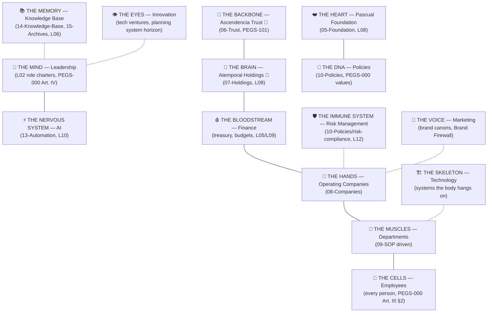

# PEGS-150.003 — Enterprise Organizational Blueprint (The Living Organism)

| Field | Value |
|---|---|
| Document ID | PEGS-150.003 |
| Series | 150 — Enterprise Architecture (02-Governance) |
| Version | 0.1.0 |
| Status | DRAFT — awaiting Founder ratification |
| Custodian | Founder (Chief Enterprise Architect function) |
| References | PEGS-150.001–.002; PEGS-000 Art. I, III, VI; libraries L01–L12 |
| Review cadence | Annual |

> **Extends PEGS-150.001.** The layers said what the structure IS; this
> blueprint says how it LIVES. A physician founded this Enterprise — it is
> architected the way a physician understands systems: as anatomy, where
> every organ exists because the body dies without it.

---

## 1. The organism

## 2. Why each analogy exists

| Organ | System | Why this analogy is true, not decorative | Canon home |
|---|---|---|---|
| **The Backbone** — Ascendencia Trust 🔮 | Continuity, protection, governance, resilience | A body without a spine collapses regardless of how strong its muscles are. The trust holds everything upright across generations and shields the organs from shocks (lawsuits, death, division). It doesn't act — it *bears*. | 06-Trust; PEGS-101 |
| **The Brain** — Atemporal Holdings 🔮 | Capital allocation, coordination, investments, intelligence | The brain doesn't pump blood or grip tools; it decides where energy goes. Holdings runs the capital waterfall, coordinates entities via agreements, and concentrates enterprise intelligence — decision, not labor. | 07-Holdings; L09 |
| **The Heart** — Pascual Foundation | Mission, legacy, culture, impact, values | Cut the heart and the body dies with perfect bones intact. Giving is the circulation of purpose: the Foundation keeps mission blood moving so commerce never becomes the point. *No curo. Sostengo* made institutional. | 05-Foundation; PEGS-000 Art. I, VII |
| **The Hands** — Operating Companies | Revenue, patients, products, execution | Hands touch the world. Every patient seen, product shipped, and dollar earned happens at the hands — which is why they get the most protection (independence, charters, firewalls) and the most training (SOPs). | 08-Companies; PEGS-100 |
| **The Muscles** — Departments | Repeatable power | Muscle is organized, trained tissue — strength through repetition. Departments turn individual effort into coordinated force via SOPs; untrained muscle is just effort (Art. III §5: systems over heroics). | 09-SOP |
| **The Cells** — Employees | The living unit | Nothing in the body is alive except cells. Every value, policy, and plan either lives in a person or lives nowhere. Hence dignity first (Art. III §2) — the organism that attacks its own cells is diseased. | L02; PEGS-000 Art. III |
| **The Memory** — Knowledge Base | Learning, continuity | An organism that can't remember re-learns fire daily. Ratified learnings, glossary, archives — memory is what makes the second decade cheaper than the first. | 14/15; L06 |
| **The Nervous System** — AI | Signal, speed, coordination | Nerves don't decide (that's the mind) — they carry signals fast and trigger reflexes (automations). AI moves information and executes reflex-work; judgment stays with the mind. The firewall is the blood-brain barrier: some things never cross. | 13-Automation; L10 |
| **The DNA** — Policies | Identity replicated in every cell | DNA is the instruction set every new cell inherits without being re-taught. Policies (and beneath them, PEGS-000's values) make the thousandth hire behave like the first ten. Mutations (exceptions) are rare, written, and reviewed. | 10-Policies; PEGS-000 Art. III |
| **The Mind** — Leadership | Judgment, will, direction | Above the brain's calculation sits the mind's judgment — values applied under uncertainty. Leadership principles (Art. IV) are the Enterprise's mind: what it attends to, what it refuses. | L02; PEGS-000 Art. IV |
| **The Eyes** — Innovation | Seeing what's coming | Eyes exist so the body meets the future before it collides with it. Innovation scans horizons (planning system's decade questions, tech ventures) so the Enterprise sees change while there's still time to move. | Planning (L05); tech ventures |
| **The Immune System** — Risk Management | Detection, response, memory of threats | Immunity isn't the absence of pathogens — it's rehearsed response. Registers detect, incident response reacts, and closed incidents become antibodies (ratified learnings). An enterprise without one dies of its first serious infection. | L12 |
| **The Bloodstream** — Finance | Circulation of resources | Blood must reach every organ, clean and measured — anemia (no cash) and hemorrhage (leaks) both kill. Treasury discipline, budgets, and the waterfall are circulation; days-cash is blood pressure, monitored with floors. | L05/L09 |
| **The Voice** — Marketing | How the organism speaks | One body, distinct voices for distinct rooms — but never lies. Brand canons govern each voice; the Brand Firewall keeps the personal voice (SOSTENGO) from ever selling and commercial voices from impersonating it. | Brand canons; Art. VI §4.2 |
| **The Skeleton** — Technology | Structure everything hangs on | The skeleton is invisible when healthy and catastrophic when broken. EHR, infrastructure, and platforms are load-bearing: chosen deliberately, maintained, with exits planned (BCP dependency inventory). | L12 BCP; 13-Automation |

## Governance notes

The metaphor is pedagogy with teeth: in onboarding and family education,
each organ maps to a real canon location — a steward who learns the body
has learned the filing system. It also diagnoses: "we keep re-learning
things" = memory problem (L06); "cash is tight everywhere" = circulation
problem (L09); "we got surprised" = eyes problem (planning horizon).

## Implementation recommendations

1. Use §2's table as the onboarding one-pager after the Enterprise Charter
   (L01) in every reading path.
2. Heir-education (06-Trust) adopts the organism as its teaching frame —
   anatomy is how a physician's family will naturally learn governance.

## Future dependencies

Backbone/Brain rows activate fully at Phase 6 formation · Voice expands as
brand canons instantiate · Eyes formalize when an innovation function is
chartered.

## Revision history

| Version | Date | Change | Author |
|---|---|---|---|
| 0.1.0 | 2026-07-19 | Initial draft (Phase 3.5) | Chief Enterprise Architect, at Founder direction |
