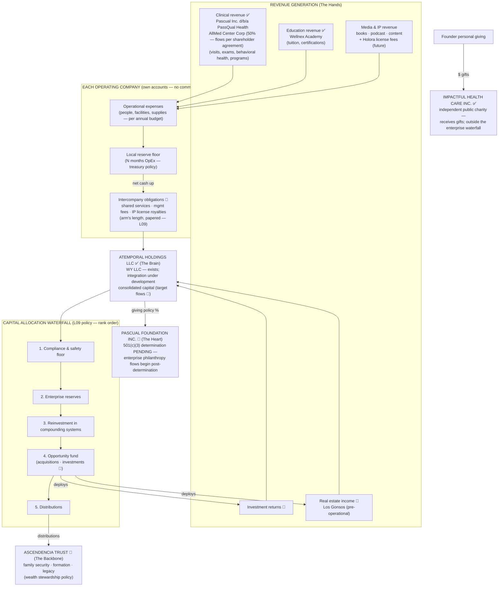

# PEGS-150.005 — Enterprise Cash Flow Blueprint

| Field | Value |
|---|---|
| Document ID | PEGS-150.005 |
| Series | 150 — Enterprise Architecture (02-Governance) |
| Version | 1.0.0 |
| Status | RATIFIED — 2026-07-19 (PR #5 + PR #6, Founder written ratification) |
| Custodian | Founder (Chief Enterprise Architect function) |
| References | PEGS-150.002/.004; L09 capital allocation + treasury + intercompany guide; L05 budgets |
| Review cadence | Annual, with the capital allocation policy |

> **Conceptual only.** This blueprint maps the *intended* movement of funds.
> It is not tax advice, not a legal structure, and creates no obligations —
> counsel and tax advisors design the instruments (Phase 6). Where this map
> and an executed legal instrument differ, the instrument governs at law
> and this map gets amended to match reality.

---

## 1. The master flow

**Until Holdings integration completes:** Atemporal Holdings LLC exists
(WY LLC), but its papered flows are still under development — so the same
waterfall runs behaviorally inside each entity and at the Founder level.
The *order* is already policy (L09); integration only centralizes it.

## 2. Flow rules (the discipline behind the arrows)

| Flow | Rule | Canon |
|---|---|---|
| Revenue → OpCo | Lands only in that entity's own account | Treasury §1 |
| OpCo → Holdings | Only as papered flows: services, mgmt fees, royalties, or declared distributions — never informal transfers | L09 intercompany |
| Intercompany pricing | Arm's length; "would we sign this with a stranger?" reviewed annually | L09 |
| Reserves | Local floor first, enterprise reserve second — both with named month-counts | Capital policy §1 |
| Investments | Opportunity fund only, capped %, Class 2 hurdles | Capital policy §2 |
| Licensing/royalties 🔮 | IP entity licenses to OpCos; Founder's name/likeness licensed personally, revocable, never sold | L09 §3 |
| Philanthropy 🔸 | A policy-set flow (not leftovers): named % or amount, via Pascual Foundation governance — activates only after IRS determination; until then, giving is the Founder's personal act | L08; wealth policy |
| Gifts to Impactful Health Care | Personal/donor gifts only — IHC is an independent charity, never inside the enterprise waterfall and never consolidated | 150.002 governance note |
| ROBS constraint (Los Gonsos) 🔸 | Flows into/out of the ROBS-structured entity follow counsel's documentation — architecture flags, counsel governs | 150.004 §1 row 003 |
| Distributions | Last in the waterfall, never instead of floors; then governed by the wealth stewardship policy inside the family | Capital §1.5; L07 |
| All flows | Visible on the consolidated dashboard ⚙; days-cash floors alarmed | Treasury §5 |

## 3. What this blueprint deliberately does NOT do

No entity formation, no tax positions, no transfer-pricing opinions, no
trust mechanics, no distribution amounts. Those are Phase 6 work with
counsel and tax advisors, executed against this map.

## Governance notes

Cash discipline is a firewall cousin: commingling is prohibited conduct
(treasury policy), and every exception to the waterfall is a recorded
written decision. The map's 🔶/🔮 marks match PEGS-150.002 exactly.

## Implementation recommendations

1. Adopt the waterfall *behaviorally now* (pre-Holdings) — it requires no
   legal work, only discipline.
2. Set the two reserve month-counts and the philanthropy % as Founder
   decisions during Phase 4 instantiation (they are blanks in L09/L08
   templates today).

## Future dependencies

Phase 6 formation (Trust, Holdings, IP/RE/investment entities) ·
management/services agreements execution · giving policy ratification.

## Revision history

| Version | Date | Change | Author |
|---|---|---|---|
| 0.1.0 | 2026-07-19 | Initial draft (Phase 3.5) | Chief Enterprise Architect, at Founder direction |
| 0.2.0 | 2026-07-19 | Amendment A1: verified sources (education in, AllMed removed), Atemporal as existing, Foundation pending-status rule, IHC outside the waterfall, ROBS flow constraint | Chief Enterprise Architect, from Founder-supplied data |
