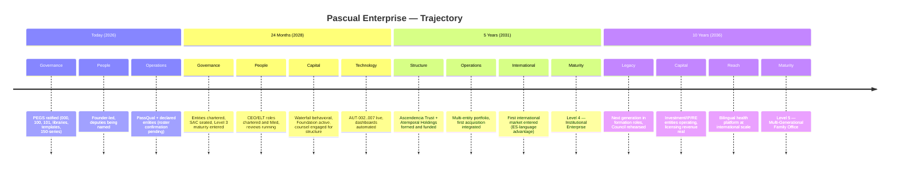
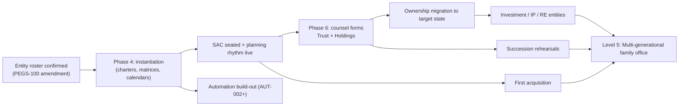

# PEGS-150.007 — Five-Year Enterprise Blueprint (Today → 24 Months → 5 Years → 10 Years)

| Field | Value |
|---|---|
| Document ID | PEGS-150.007 |
| Series | 150 — Enterprise Architecture (02-Governance) |
| Version | 0.1.0 |
| Status | DRAFT — awaiting Founder ratification |
| Custodian | Founder (Chief Enterprise Architect function) |
| References | PEGS-150.001–.006, .009; L05 planning system; 06-Trust succession roadmap |
| Review cadence | Annual, at the retreat (feeds the annual plan) |

> **Directional, not committal.** This blueprint sets trajectory; the
> annual/quarterly planning system (L05) makes the actual commitments.
> Dates shift; sequence does not — each horizon builds on the previous
> (the legitimacy-chain rule applied to time).

---

## 1. Horizon map

## 2. Dimension roadmaps

| Dimension | Today (2026) | 24 months | 5 years | 10 years |
|---|---|---|---|---|
| **People** | Founder + clinic team + deputies being named | CEO + ELT chartered and hired; performance rhythm running | Operators run entities; Founder chairs and teaches | Second-generation stewards in real roles, earned |
| **Governance** | Canon complete; Founder mode | Entity charters + matrices instantiated; SAC quarterly | Councils rehearsed; Level 4 processes | Council-ready succession; annual reviews institutional |
| **Technology** | Repo canon; EHR; manual dashboards | AUT catalog live (lint, sync, meeting chain, ICS) | Integrated data layer across entities | Enterprise intelligence platform (the Skeleton mature) |
| **Infrastructure** | Miami Gardens clinic | Optimized clinic ops; possible second site TO CONFIRM | RE entity owns operating real estate 🔮 | Multi-site, multi-market footprint |
| **Foundation** | Formation status TO CONFIRM 🔶 | Active giving under L08 governance; first impact report | Endowment rhythm from Holdings % | Institutional philanthropy; family-led board seats |
| **Trust** | Roadmap + sealed roster (06-Trust) | Instruments drafted with counsel | Ascendencia Trust executed and funded | Trust tested (reviews, trustee succession rehearsed) |
| **Holdings** | Waterfall behavioral | Atemporal Holdings formed 🔮; agreements papered | Owns OpCos; capital engine running | Full portfolio brain: OpCos + INV/IP/RE |
| **International** | Bilingual content reach | ES-market publishing/media expansion | First clinical/advisory international presence | Multi-country operations under local counsel |
| **AI** | Claude Code governance engine; AI policy template | Policy ratified; nervous-system reflexes live (L10) | AI-assisted ops in every entity within firewalls | Institutional AI layer, human-owned per doctrine |
| **Automation** | Catalog seeded (AUT-001 live) | AUT-002..007 shipped | Meeting/reporting chains fully automated | Self-maintaining canon infrastructure |
| **Acquisitions** | Criteria in L09 | First targets evaluated via Five Gates + memo | First acquisition closed (PEGS-000 adopted at close) | Portfolio growth by playbook |
| **Capital strategy** | Reserves building; budgets instantiating | Reserve floors met; opportunity fund funded | Investment entities deploying 🔮 | Compounding engine across asset classes |
| **Legacy** | Heir-education path defined | Family constitution drafted with family | Next generation inside formation stages | Stewards ready; the Founder well-replaced (Art. VII) |

## 3. Sequence dependencies (what unlocks what)

## Governance notes

Horizons are reviewed annually at the retreat (block 3 — the big
questions); movement between maturity levels is declared per PEGS-150.009,
never assumed.

## Implementation recommendations

1. Treat the 24-month column as the source for the next two annual plans'
   objectives (L05).
2. Any acquisition or international step earlier than mapped is fine — but
   it must pass its Class 2 memo against this blueprint's sequence
   ("why out of order?" becomes a named question in the memo).

## Future dependencies

Everything in §3 — this document is the dependency map.

## Revision history

| Version | Date | Change | Author |
|---|---|---|---|
| 0.1.0 | 2026-07-19 | Initial draft (Phase 3.5) | Chief Enterprise Architect, at Founder direction |
