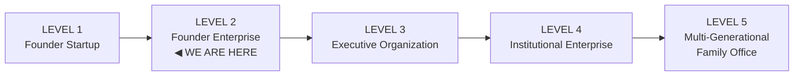

# PEGS-150.009 — Governance Maturity Roadmap

| Field | Value |
|---|---|
| Document ID | PEGS-150.009 |
| Series | 150 — Enterprise Architecture (02-Governance) |
| Version | 0.1.0 |
| Status | DRAFT — awaiting Founder ratification |
| Custodian | Founder (Chief Enterprise Architect function) |
| References | PEGS-150.007 (horizons map to levels); PEGS-000; PEGS-101; all libraries |
| Review cadence | Annual — level assessment at the constitutional review |

> **The maturity model.** Five levels from founder-startup to
> multi-generational family office. Levels are DECLARED at the annual
> constitutional review against the criteria below — never assumed from
> revenue or headcount. PEGS is designed so the same canon governs at
> every level; what changes is who operates it.

---

## 1. The five levels

## 2. Level definitions

| Dimension | L1 — Founder Startup | L2 — Founder Enterprise | L3 — Executive Organization | L4 — Institutional Enterprise | L5 — Multi-Gen Family Office |
|---|---|---|---|---|---|
| **Characteristics** | Everything is the Founder; heroics daily | Canon exists; Founder still executes most | Executives run entities; Founder governs | Institutions run themselves; Founder chairs | Stewards govern; Founder's philosophy outlives him |
| **Governance** | Verbal, ad hoc | Written canon ratified (PEGS complete) — decisions classed | Charters + matrices instantiated; bodies meeting | Councils rehearsed; audits routine | Trust + Council govern; family constitution living |
| **Meetings** | As needed | Meeting Kit exists; rhythm starting | Full cadence stack chaired by executives | Rhythm survives any individual's absence | Family + governance rhythms integrated |
| **Leadership** | Founder alone | Founder + deputies named | CEO/ELT hired, reviewed, developing successors | Bench two-deep every seat | Next generation earned into real roles |
| **Risk** | In the Founder's head | Registers templated | Registers live, owners assigned, quarterly rhythm | BCP tested annually; incidents produce antibodies | Multi-entity risk federated; insurance architecture mature |
| **Automation** | None | Catalog seeded; AUT-001 live | AUT-002..007 shipped; meeting chain automated | Self-maintaining canon; dashboards enterprise-wide | Institutional AI layer, human-owned |
| **Knowledge** | Memory = Founder | Glossary + system defined | Ratified learnings flowing; onboarding paths used | Decision archive institutional | The Playbook is how new stewards learn the body |
| **AI** | Personal tool use | Governance engine (Claude Code) + policy template | Policy ratified; reflex automations within firewalls | AI in every entity's operations, inspected | Nervous system mature — signals fast, judgment human |
| **Compliance** | Reactive | Matrix templated | Matrix populated; calendar automated; zero missed dates | Audits clean by habit | Multi-jurisdiction compliance federated |
| **Legal maturity** | Sole owner, minimal structure | Entities declared; independence practiced behaviorally | Charters + intercompany agreements papered | Trust + Holdings executed; target ownership live | Instruments tested (successions, distributions, reviews) |
| **Decision process** | Founder decides, unrecorded | Classes + memos + gates in force | Class 3 fully delegated; memos habitual | C-consultations institutional; dissent archives teaching | Council supermajorities; Founder-mode fully retired |

## 3. Level transitions — exactly how PEGS evolves

**L1 → L2 (COMPLETE, 2026-07-19).** The canon was written and ratified:
PEGS-000/100/101, 15 folders, twelve libraries, 48 templates, 150-series.
PEGS's role: *created*.

**L2 → L3 (the Phase 4–5 climb).** Gate criteria: entity roster amended
into PEGS-100 · role charters + authority matrices instantiated with real
names and thresholds · planning cadence chaired by non-Founder executives
for 2 consecutive quarters · SAC seated and meeting · AUT-002..007 live.
PEGS's role: *instantiated* — templates become signed documents.

**L3 → L4 (the Phase 6 climb).** Gate criteria: Trust + Holdings executed
and funded · ownership migrated to target state · BCP tabletop passed ·
first acquisition integrated under PEGS-100 §5 · two annual constitutional
reviews held with full attendance · incident response exercised for real
at least once. PEGS's role: *institutionalized* — the canon runs whether
or not the Founder is in the room that week.

**L4 → L5 (the decade climb).** Gate criteria: next generation completed
formation stages (heir education) and holds earned roles · Stewardship
Council rehearsed (annual reviews + simulation of activation) · family
constitution ratified by the family · trustee succession named and tested
· the Playbook compiled, printed, and taught. PEGS's role: *inherited* —
the system's final exam is a succession nobody dreads.

**Regression rule.** Levels can be LOST (an executive exodus can drop L3
→ L2). The annual review assesses honestly in both directions; a lost
level reactivates that transition's gate criteria as the recovery plan.

## Governance notes

Level declarations are recorded in the constitutional review record
(11-Meetings). Marketing never uses levels; they are internal engineering
truth, not brand copy.

## Implementation recommendations

1. Add "current maturity level + gate progress" as a standing line in the
   annual constitutional review agenda (L01 SOP step 2).
2. Print §2 beside the Five-Year Blueprint at every retreat — trajectory
   and maturity are the same conversation.

## Future dependencies

Every phase: Phase 4 targets L3 gates; Phase 6 targets L4 gates; the
decade targets L5.

## Revision history

| Version | Date | Change | Author |
|---|---|---|---|
| 0.1.0 | 2026-07-19 | Initial draft (Phase 3.5) | Chief Enterprise Architect, at Founder direction |
