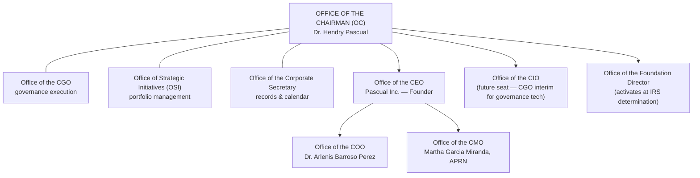

# The Executive Office Architecture

> Established by Chairman's Directive No. 001. This is enterprise office
> architecture — the permanent institutional framework — not an HR org
> chart. An office is a *function with continuity*: it exists whether
> its seat is held by the Founder, a hire, or (for the CGO) an AI
> function under human authority. Offices nest inside the ratified
> decision architecture (PEGS-150.006) and change nothing about it.

## The office map

## The nine offices

### 1. Office of the Chairman (OC)
**Purpose:** the Founder's permanent executive office — attention,
decisions, memory, and legacy in one institution. **Responsibilities:**
decision queue, the briefs, PEGS-900, the Annual Declarations, summit
tradition, relationship stewardship. **Authority:** all Class 1/2 per
PEGS-000; the OC prepares, the Chairman decides. **Key deliverables:**
weekly brief · monthly book · annual declarations · summit outcomes.
**Relationship to PEGS:** consumes all canon; originates none but the
Chairman's own instruments (900-series). **Reports to:** no one; the
Constitution binds it. **Future expansion:** absorbs a human Chief of
Staff when hired — the office's documents ARE that person's onboarding.

### 2. Office of the Chief Executive Officer (CEO)
**Purpose:** enterprise-level operating leadership (currently held by
the Founder for Pascual Inc.; enterprise CEO seat opens per PEGS-150.007
24-month horizon). **Responsibilities:** execute the annual plan; own
enterprise KPIs; lead the ELT. **Authority:** PEGS-150.006 CEO column +
entity authority matrices. **Key deliverables:** monthly review ·
quarterly report · plan delivery. **Relationship to PEGS:** chief
executor of the planning system. **Reports to:** the Chairman. **Future
expansion:** first non-Founder enterprise CEO is the L2→L3 maturity
hinge.

### 3. Office of the Chief Operating Officer (COO)
**Purpose:** operations run on systems, not heroics. Seat: Dr. Arlenis
Barroso Perez. **Responsibilities:** clinic operations; SOP capture;
tracker discipline; ELT vice-chair (target chair by Oct 2026).
**Authority:** Class 3 per role charter (Wave 2); tier B matrix.
**Key deliverables:** ops KPIs · SOP index growth · coverage plans.
**Relationship to PEGS:** the operating rhythm's engine. **Reports to:**
CEO. **Future expansion:** multi-entity ops oversight as pillars grow.

### 4. Office of the Chief Medical Officer (CMO)
**Purpose:** clinical excellence and the clinical firewall, personified.
Seat: Martha Garcia Miranda, APRN. **Responsibilities:** clinical
protocols, quality, patient-safety preemption (ELT rule), licensed
escalation line. **Authority:** clinical judgments per licensure —
never overridden by any tier (PEGS-000 Art. VI §4.1). **Key
deliverables:** clinical quality metrics · protocol reviews · safety
reviews. **Relationship to PEGS:** the firewall's daily guardian.
**Reports to:** CEO (clinically autonomous within licensure). **Future
expansion:** medical directorship across clinical entities incl. AllMed
coordination.

### 5. Office of the Corporate Secretary
**Purpose:** every governance act exists on paper, on time, in the right
place (L04). **Responsibilities:** calendar, notices, minutes,
resolutions, archives, compliance dates. **Authority:** none over
substance; total over form. **Key deliverables:** Kit chains complete ·
quarter/annual indexes · zero missed filings. **Relationship to PEGS:**
the record-keeping arm (02-Governance/corporate-secretary). **Reports
to:** the Chairman via the OC. **Future expansion:** first dedicated
hire recommended by Oct 2026 (Phase 8 risk #1); CGO-automation interim.

### 6. Office of the Foundation Director
**Purpose:** the Heart's executive — Pascual Foundation programs,
grants, impact. **Responsibilities:** L08 library execution once IRS
determination issues. **Authority:** grants below board threshold (L08
SOP). **Key deliverables:** giving policy · grant log · annual impact
report (bilingual). **Relationship to PEGS:** Pillar 5 executive;
one-way philanthropy flow guardian (never mixes charity and commerce —
principle 3). **Reports to:** Foundation board (Founder pre-board).
**Future expansion:** activates at determination; family-member
candidacy per earned-not-inherited.

### 7. Office of the Chief Information Officer (CIO)
**Purpose:** the Skeleton and the Nervous System — technology and data
across the Enterprise. **Responsibilities:** EHR and platform stewardship,
cybersecurity policy execution, data governance, automation
infrastructure. **Authority:** tech within budget/policy (150.006 rows
12–13). **Key deliverables:** systems uptime · security posture ·
automation wave delivery. **Relationship to PEGS:** operates 13-Automation
with the CGO. **Reports to:** CEO. **Future expansion:** seat is FUTURE —
CGO holds governance-tech interim; clinic IT vendors hold infrastructure;
first CIO hire when tech ventures warrant.

### 8. Office of the Chief Governance Officer (CGO)
**Purpose:** PEGS functions every day — maintained, monitored, prepared,
improved, executed. **Responsibilities:** canon integrity, cadence
support, briefs and book compilation, scorecard, ratification mechanics.
**Authority:** none over decisions; total over governance form and
process; hard stop at every firewall (AI function under Founder
authority per the AI usage policy). **Key deliverables:** everything in
the OC on schedule · scorecard honesty · zero canon drift.
**Relationship to PEGS:** its operator. **Reports to:** the Chairman.
**Future expansion:** pairs with the human Chief of Staff when hired;
never replaced in accountability terms — a human always answers.

### 9. Office of Strategic Initiatives (OSI)
**Purpose:** the Enterprise Portfolio Management Office — every
strategic initiative tracked in one register (PEGS-910).
**Responsibilities:** maintain the register, surface decisions-required
to the OC queue, report portfolio health monthly (Book §8).
**Authority:** none over initiatives; total over their visibility.
**Key deliverables:** [PEGS-910](../office-of-strategic-initiatives/PEGS-910-strategic-initiatives-register.md)
current · portfolio section of PEGS-900 · initiative-brief discipline
(no untracked initiatives). **Relationship to PEGS:** the planning
system's portfolio lens. **Reports to:** the Chairman via the OC.
**Future expansion:** becomes the PMO under the enterprise CEO at L3+.

## Architecture rules

Offices are functions, not headcount — one person may hold several seats
(today the Founder holds OC/CEO/SEC-interim); a seat vacant is a seat
documented, never a function abandoned · every office's authority
derives from PEGS-150.006 and role charters — this architecture GRANTS
nothing · new offices require demonstrated operational need (CGO
Directive, Section VII).

## Revision history

| Version | Date | Change | Author |
|---|---|---|---|
| 1.0.0 | 2026-07-20 | Established per Chairman's Directive No. 001 | CGO |
