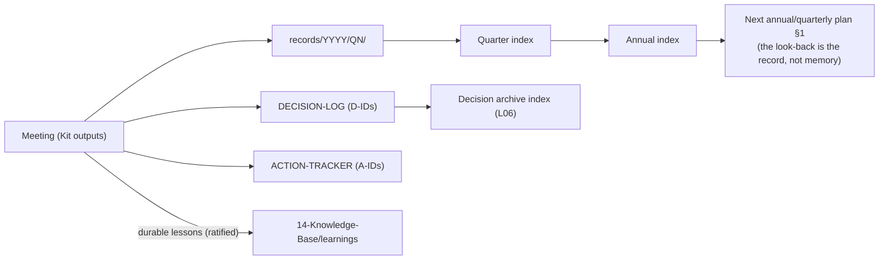

# The Official Operating Cadence

> The recurring meeting system of the Pascual Enterprise — which meetings
> exist, what each is for, who chairs, and how every one feeds the
> knowledge base and future planning. Meetings not listed here do not
> recur; one-offs are working sessions, not governance.

## The stack (five meetings, one engine)

| Meeting | Cadence | Duration | Chair (now → target) | Attendees | Templates |
|---|---|---|---|---|---|
| **ELT Weekly** | Weekly, fixed slot | 50 min | Founder → COO | ELT (see meeting-types/MEETING-elt.md) | planning-system weekly + Kit |
| **Monthly Executive Review** | 1st Monday | 90 min | Founder → CEO-delegate | ELT + entity leads | planning-system monthly + Kit |
| **Quarterly Close + Retreat** | Last week of quarter | Half–full day | Founder | ELT (+ advisors when seated) | quarterly-report + quarterly-retreat + Kit |
| **Annual cycle** (KPI review → Summit → plan ratification) | Oct → Jan | — | Founder | ELT + designated participants | PROCESS-annual-planning-cycle.md |
| **Annual Constitutional Review** | July (anniversary) | 90 min | Founder | Leadership + stewards-designate | L01 SOP + MEETING-stewardship-council.md |

**Dormant until activated:** Strategic Advisory Council quarterly (L03 —
on seating) · Stewardship Council annual session (on roster naming) ·
Family meetings (L07 — scheduled by the family, minimum 2/year, one may
fold into the Summit's closed session).

## The standardized output rule (every meeting, no exceptions)

Every convening produces, via the Meeting Kit:
**agenda → packet → minutes (with DECISIONS + ACTION ITEMS tables) →
follow-up report ≤48h → tracker update → quarterly archive → annual
archive.** Machine-parsed tables feed task/calendar automations
(AUT-005/006/007) per the Integration Standard.

## The knowledge loop (how meetings feed the future)

Rules: the quarter index closes with the quarterly report · the annual
index is the constitutional review's evidence base · a lesson enters the
knowledge base only by explicit ratification (a PR someone approved) —
insight by drift is rumor (Art. VI §2).

## Escalation inside the cadence

Overdue action >7d → next agenda §1 automatically · blocked >14d → chair
· firewall touch → Founder immediately, outside the cadence · missed
follow-up twice in a quarter → secretary role reassigned (Kit SOP).

## Revision history

| Version | Date | Change | Author |
|---|---|---|---|
| 0.1.0 | 2026-07-20 | Initial cadence charter (operational deployment) | Chief Enterprise Architect, at Founder direction |
